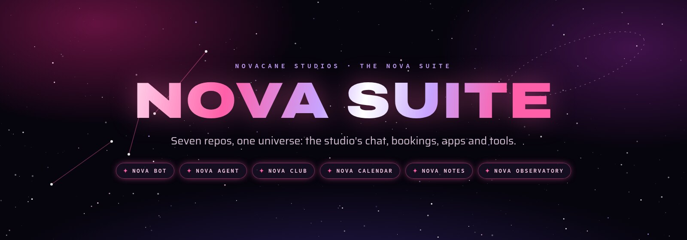
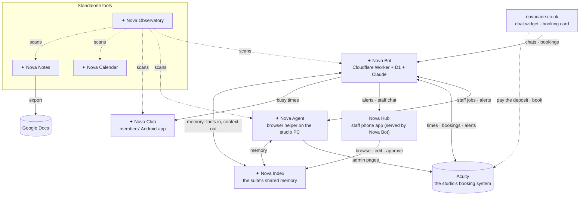

<div align="center">



**Everything that runs Novacane Studios, plus the little universe of tools around it.**<br>
The studio's chat assistant and bookings, the staff and members' apps, and a set of cosmic tools, in one home.


</div>

---

## The suite

<table>
<tr>
<td width="50%" valign="top">

### ✦ [Nova Bot](https://github.com/tuniveza/nova-bot)
**The studio's assistant and back end.** The chat on novacane.co.uk answers questions with Claude, opens a booking card that always takes the deposit before anything is booked, sends enquiries and alerts, and runs the API behind Nova Hub (the staff app) and Nova Club.

`Cloudflare Workers` `D1` `Claude` `Acuity` `Web Push`

<a href="https://github.com/tuniveza/nova-bot"></a>

</td>
<td width="50%" valign="top">

### ✦ [Nova Agent](https://github.com/tuniveza/nova-agent)
**The hands that work Acuity's admin pages.** A self-healing Playwright browser helper on the studio computer that carries out staff jobs for Nova Bot, remembering where things are and asking Claude when a page changes.

`TypeScript` `Playwright` `Claude` `systemd`

<a href="https://github.com/tuniveza/nova-agent"></a>

</td>
</tr>
<tr>
<td width="50%" valign="top">

### ✦ [Nova Club](https://github.com/tuniveza/nova-club)
**The members' Android app.** Memberships, perks and a moon-phase booking calendar that shows when the studio is free, live from Nova Bot.

`Kotlin` `Jetpack Compose` `Android`

<a href="https://github.com/tuniveza/nova-club"></a>

</td>
<td width="50%" valign="top">

### ✦ [Nova Notes](https://github.com/tuniveza/nova-notes)
**A note editor that writes from the centre outwards.** Google Docs–style writing, centred by default, with six themes. Import Word, Markdown and HTML; send notes to Google Docs. Installable and works offline.

`PWA` `Vanilla JS` `IndexedDB` `Google Drive API`

**[Open Nova Notes →](https://nova-notes.novacane-studio.workers.dev)**

<a href="https://github.com/tuniveza/nova-notes"></a>

</td>
</tr>
<tr>
<td width="50%" valign="top">

### ✦ [Nova Calendar](https://github.com/tuniveza/nova-calendar)
**A cosmic calendar.** Note cards and day cards under the real sky (moon phases, seasons, meteor showers), with a generated space picture for every note. Installable and works offline.

`PWA` `Vanilla JS` `Canvas` `Meeus astronomy`

**[Open Nova Calendar →](https://nova-calendar.novacane-studio.workers.dev)**

<a href="https://github.com/tuniveza/nova-calendar"></a>

</td>
<td width="50%" valign="top">

### ✦ [Nova Observatory](https://github.com/tuniveza/nova-observatory)
**Every project in one sky.** A dashboard that scans each project for its size, languages, goal and vision, and shows it with screenshots and a demo video.

`Node` `Playwright` `ffmpeg`

<a href="https://github.com/tuniveza/nova-observatory"></a>

</td>
</tr>
</table>

### ✦ [Nova Index](https://github.com/tuniveza/nova-index)
**Everything the suite remembers, in one place.** One shared memory for every Nova app: conversations go in, small files of one-line facts come out (studio, staff and customer), and each app reads back only what a turn needs. Browse it, watch it grow, edit a line, and approve what's learned about customers.

`Cloudflare Workers` `D1` `Claude` `PWA`

## How it fits together



**The booking rule:** nothing is ever booked before the deposit is paid. Nova Bot checks the time and fills in the details, then the customer pays on Acuity's own booking page, and paying is what makes the booking.

## Get everything

Each project is its own repo, linked here as a git submodule:

```sh
git clone --recurse-submodules https://github.com/tuniveza/nova-suite.git
cd nova-suite

# later: bring every project up to its latest version
git submodule update --remote --merge
```

| Folder | Repo | What it is | Run it |
|---|---|---|---|
| `nova-bot/` | [tuniveza/nova-bot](https://github.com/tuniveza/nova-bot) | Chat, bookings, Nova Hub back end | `npm install && npm run sandbox` |
| `nova-agent/` | [tuniveza/nova-agent](https://github.com/tuniveza/nova-agent) | Acuity browser helper | see its README (needs an Acuity login) |
| `nova-club/` | [tuniveza/nova-club](https://github.com/tuniveza/nova-club) | Members' Android app | open in Android Studio |
| `nova-calendar/` | [tuniveza/nova-calendar](https://github.com/tuniveza/nova-calendar) | Cosmic calendar (PWA) | [use it online](https://nova-calendar.novacane-studio.workers.dev) or open `index.html` |
| `nova-notes/` | [tuniveza/nova-notes](https://github.com/tuniveza/nova-notes) | Note editor (PWA) | [use it online](https://nova-notes.novacane-studio.workers.dev) or `python3 -m http.server` |
| `nova-observatory/` | [tuniveza/nova-observatory](https://github.com/tuniveza/nova-observatory) | Project dashboard | `npm install && npm run scan` |
| `nova-index/` | [tuniveza/nova-index](https://github.com/tuniveza/nova-index) | The suite's shared memory (browse, edit, approve) | [use it](https://novacane-worker.novacane-studio.workers.dev/app/memory/) (Nova Hub sign-in) |

Every repo has its own README with screenshots, a demo and set-up notes.

## The look

The whole suite shares one visual language, taken from novacane.co.uk:
- **Archivo** (wide, 900) for display and **Saira** for reading.
- Magenta and purple nebulae, star fields and constellations.
- Six shared colour themes: **Novacane** (magenta), **Solar Flare** (red-orange), **Pulsar** (cyan), **Aurora** (green and violet), **Eclipse** (gold) and **Quasar** (ultraviolet).

---

<p align="center"><sub>Made for <b>Novacane Studios</b> · All rights reserved</sub></p>
